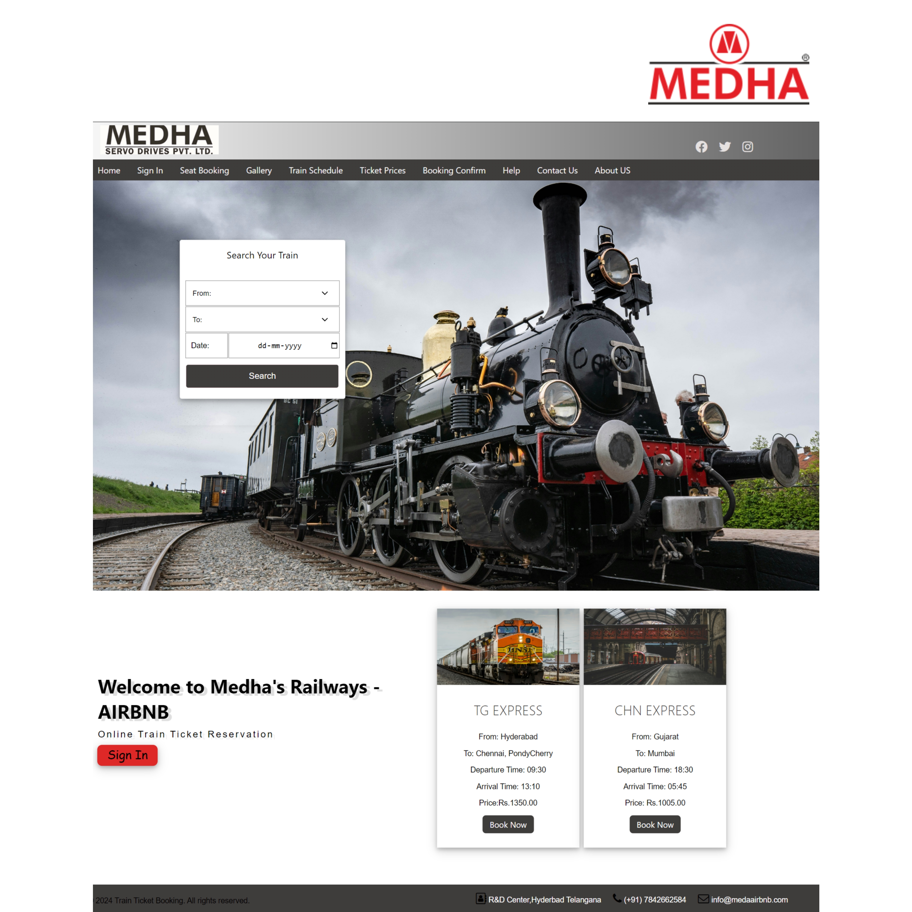

# ”AIRBNB - Accessible Infrastructure for Railway Bookings and Networking Bureau”

Welcome to AIRBNB, a web-based train reservation system developed as part of our university group project! This system allows users to easily search for train routes, check availability, and make reservations hassle-free.

## [”AIRBNB - Accessible Infrastructure for Railway Bookings and Networking Bureau” Preview]

## Features

- **User-Friendly Interface:** ”AIRBNB - Accessible Infrastructure for Railway Bookings and Networking Bureau” offers an intuitive and user-friendly interface, making it easy for users to navigate and book train tickets.

- **Real-Time Train Information:** Get access to real-time train information, including schedules, seat availability, and ticket prices.

- **Secure and Reliable:** Rest assured that your personal and payment information is safe and secure with our robust data protection measures.

- **Responsive Design:** ”AIRBNB - Accessible Infrastructure for Railway Bookings and Networking Bureau” is fully responsive, ensuring a seamless user experience across various devices, including large screens.

## Live Demo

Experience ”AIRBNB - Accessible Infrastructure for Railway Bookings and Networking Bureau” live by visiting [here]().

## Installation

To run TrainGo locally, follow these steps:

1. Clone the repository: `git clone `
2. Navigate to the project directory: `cd "AIRBNB”`
3. Open `index.html` in your preferred web browser.

## Feedback

Your feedback and suggestions are valuable to us. If you encounter any issues or have ideas for improvements, please open an issue on the GitHub repository.

